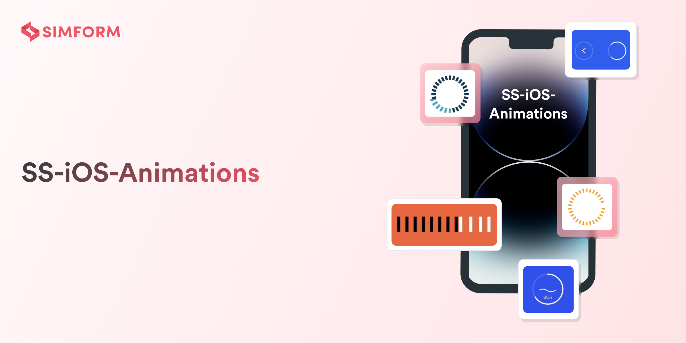
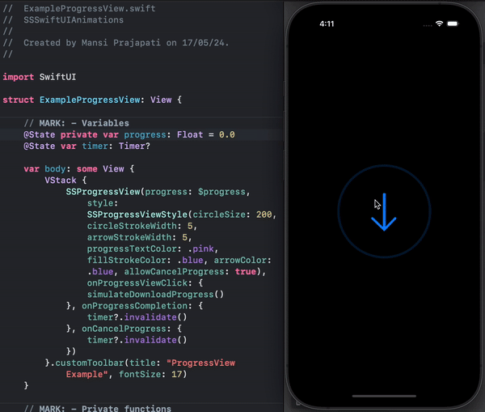
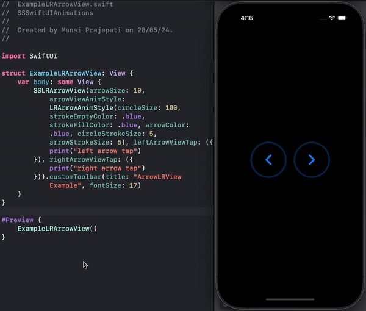
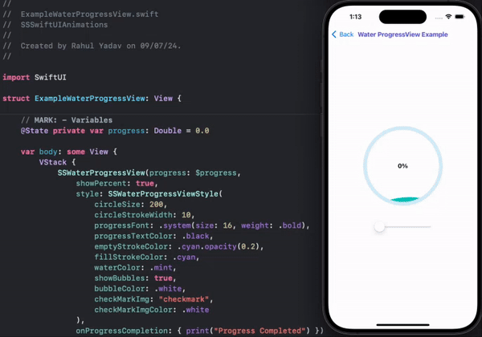

# SS-iOS-Animations

SwiftUI animation library to bring your app to life. ✨

🚀  **SS-iOS-Animations**: Turn ordinary user interfaces into extraordinary experiences! With this library, you can make your app more fun
    and engaging by adding smooth and eye-catching animations to your app. Whether you're new to SwiftUI or a pro, our easy-to-use animations make it
    simple to add that extra wow factor to your app. Spice up your app with cool transitions, fun effects, and interactive touches, all thanks to
    **SS-iOS-Animations**. Try it out and take your SwiftUI apps to the next level! ✨
    
   [Check out the Examples](SSSwiftUIAnimations/Examples)

## Animations

### ProgressView ⏳ 

[**Code Link**](SSSwiftUIAnimations/Sources/ProgressAnimation)

### Left Right ArrowView ↔

[**Code Link**](SSSwiftUIAnimations/Sources/ArrowLeftRightAnimation)

### Water Effect ProgressView 🌊

[**Code Link**](SSSwiftUIAnimations/Sources/WaterProgressAnimation)

## Found these animations useful? :heart:

Support it by joining [stargazers] :star: for this repository.

## How to Contribute :handshake:

Whether you're helping us fix bugs, improve the docs, or a feature request, we'd love to have you! :muscle: \
Check out our __[Contributing Guide]__ for ideas on contributing.

## Bugs and Feedback

For bugs, feature feature requests, and discussion use [GitHub Issues].

## Checkout our Other Mobile Libraries

Check out our other libraries [Awesome-Mobile-Libraries].

## License

Distributed under the MIT license. See [LICENSE] for details.

<!-- Reference links -->

[stargazers]:               https://github.com/SimformSolutionsPvtLtd/SS-iOS-Animations/stargazers

[Contributing Guide]:       CONTRIBUTING.md

[Awesome-Mobile-Libraries]: https://github.com/SimformSolutionsPvtLtd/Awesome-Mobile-Libraries

[Github Issues]:            https://github.com/SimformSolutionsPvtLtd/SS-iOS-Animations/issues

[license]:                  LICENSE
